## Hawaii HOME Poject

### Goal

The goal of Hawaii HOME Project is to create a mobile application to aid a medical clinic to keep track of current inventory of medications and supplies, vaccines records, and have acess to patient's health information. 

### Deployment

[runtime-terrorz.xyz](https://runtime-terror.xyz/)

As we progress through the development of this web application, our vision for the layout of our application will reflect the following pages:

- Sign in/Sign up 
- Landing Page
- Add Order Page
- Inventory Page
- Edit Inventory Page
- Dispense Page
- Multi-Dispense Page
- Low-Report Page

Admin and Super Role:
- Manage Accounts Page
- Log History Page

Features encapsulated in the pages: 
- Notifications
- Search Bar, Filter, Dispense by Lot (List Inventory Page)
- Change Role, Remove Account (Manage Account Page)

### Sign in/Sign up Page

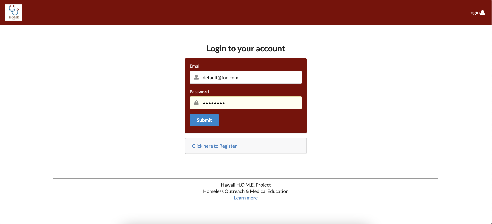
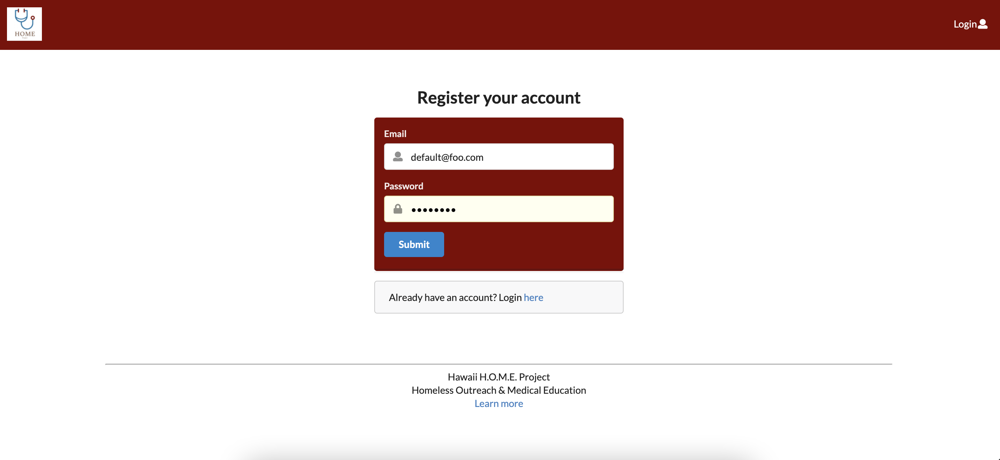

### Landing Page

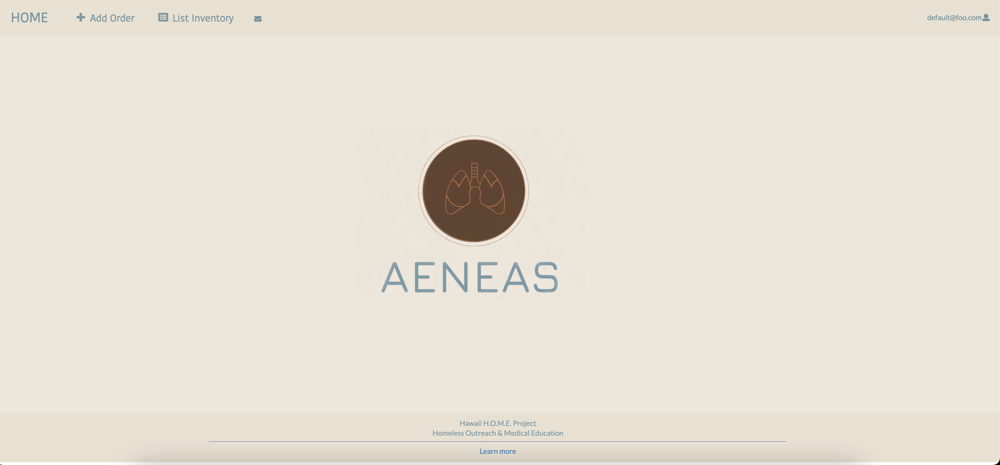

### Add Order

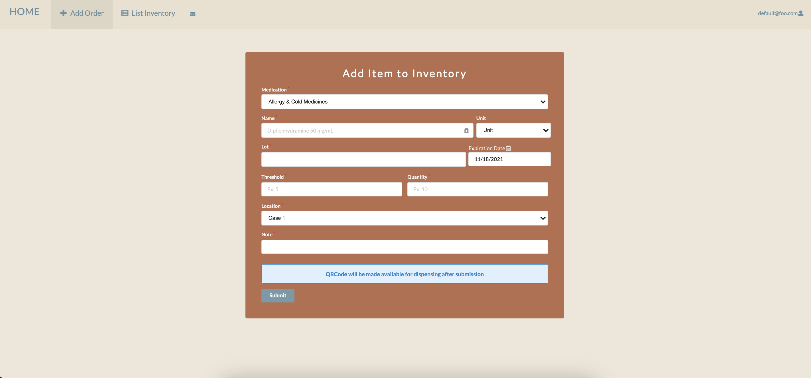

## Inventory Page

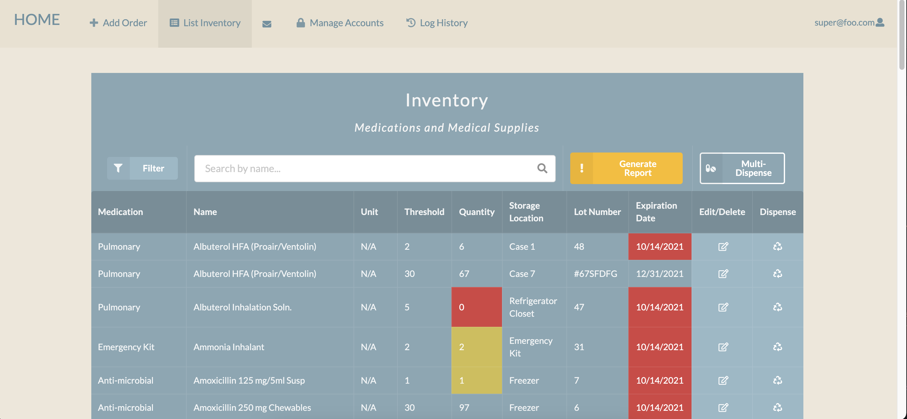

### Filter

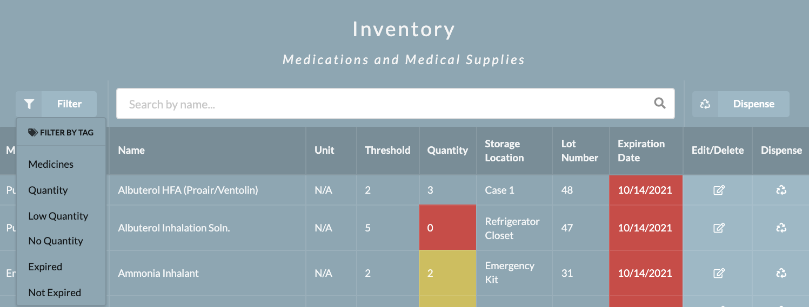

### Seach By Name

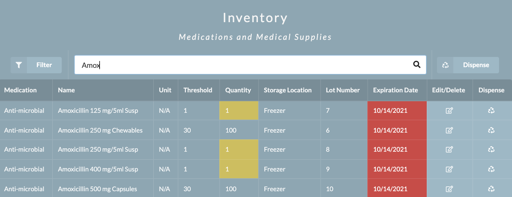

### Edit Inventory

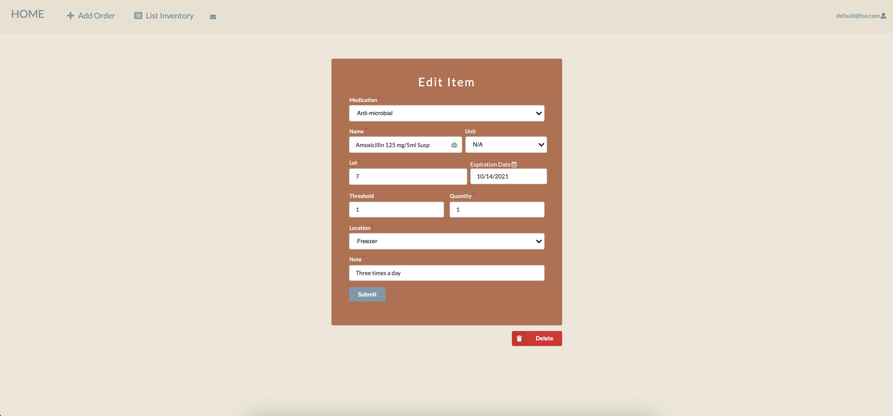

### Dispense Inventory

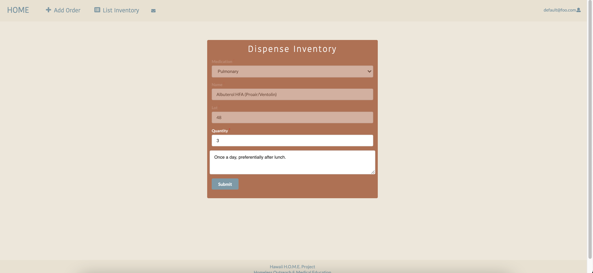

### Notification

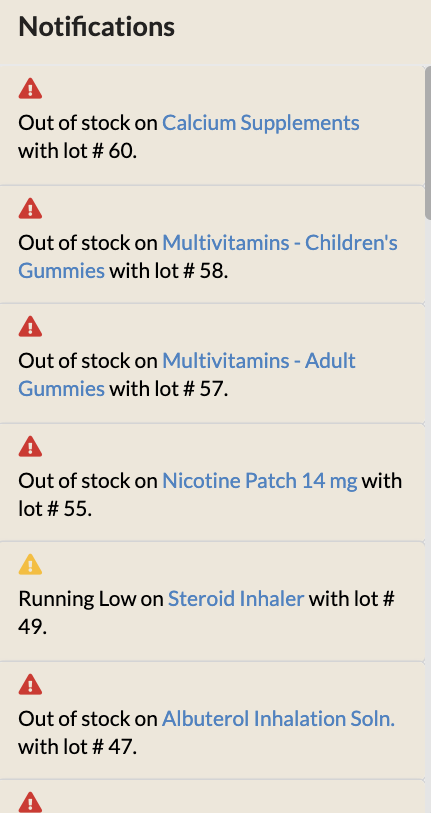

## Low-Report

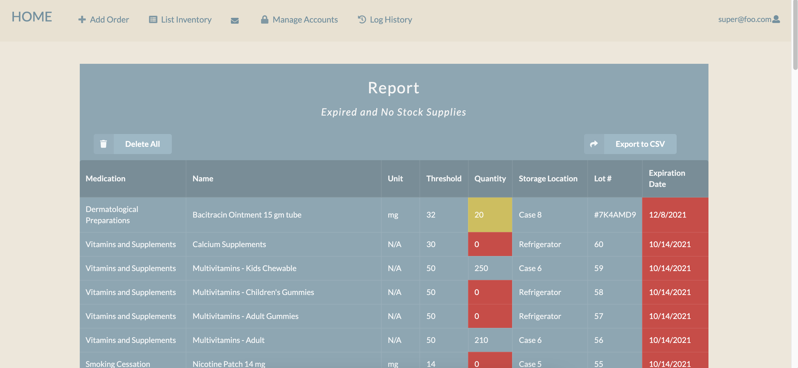

### Items Added

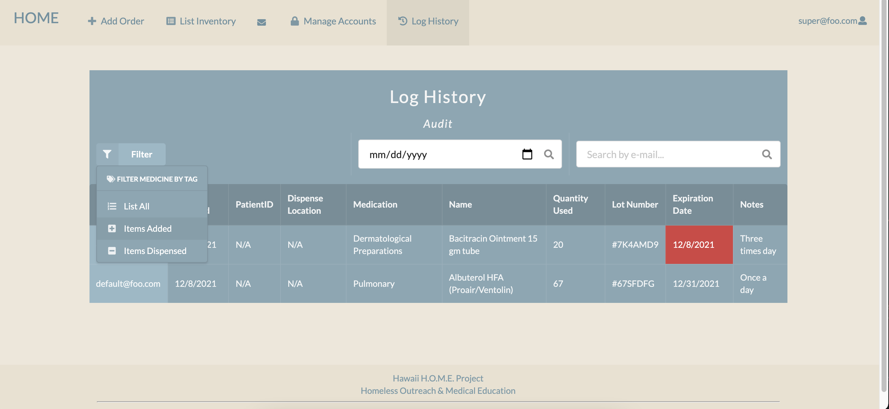

### Items Dispensed

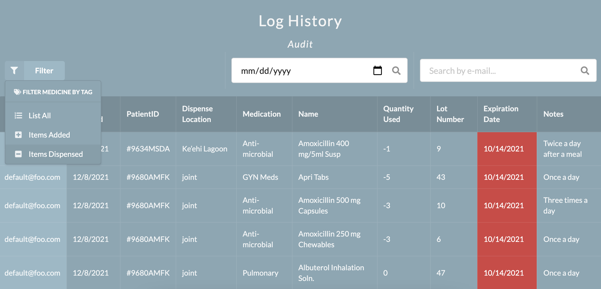

### CSV Report

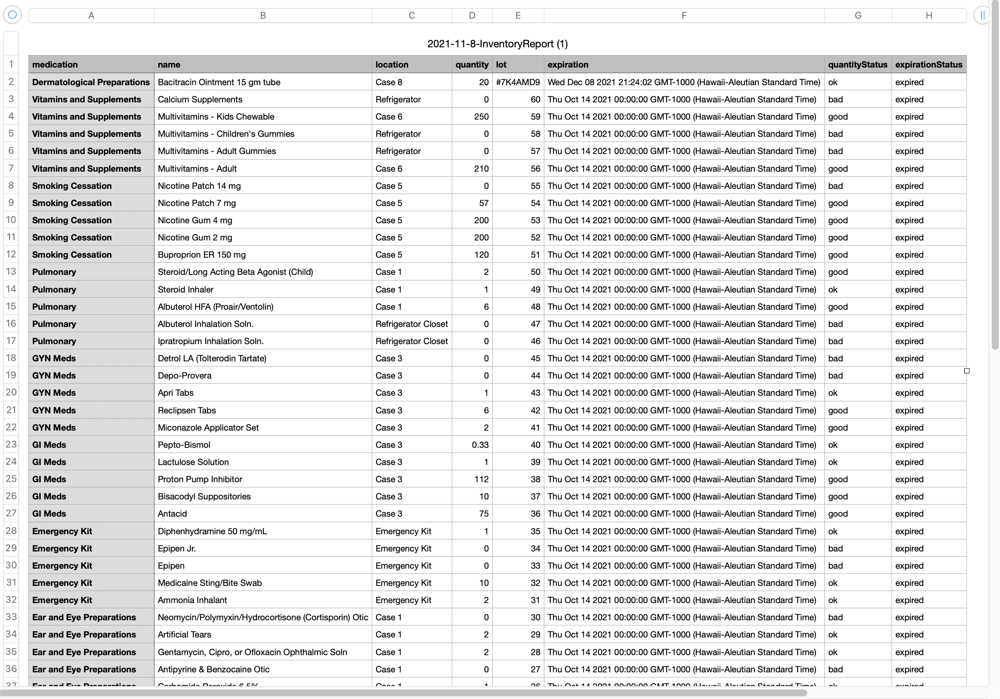

## Multi-Dispense Items

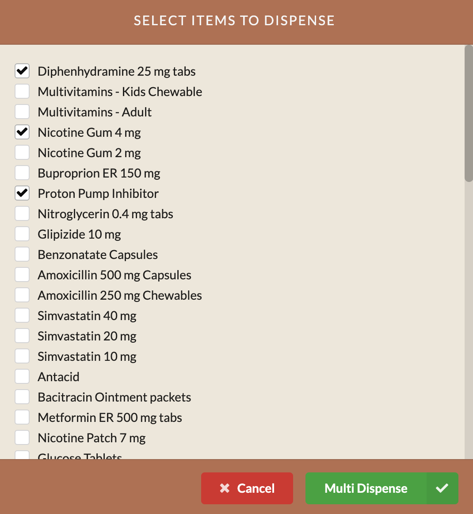

### Multi-Dispense

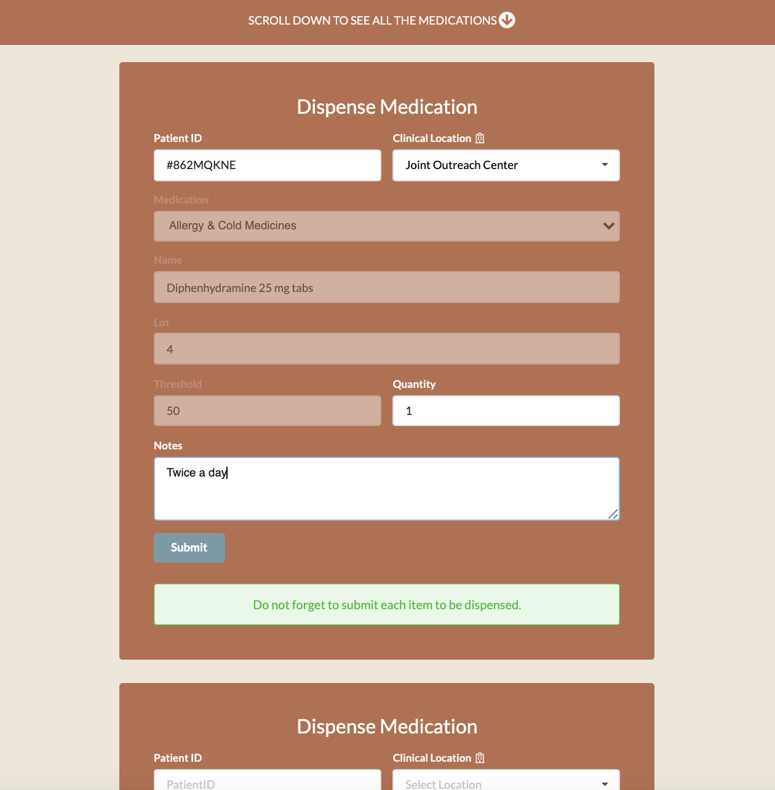

## Admin and Super Level

### Manage Accounts

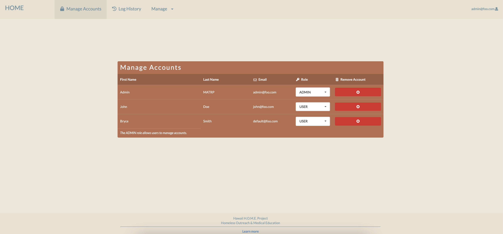

