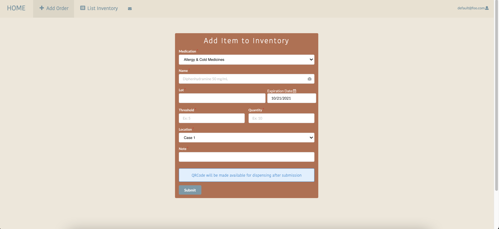
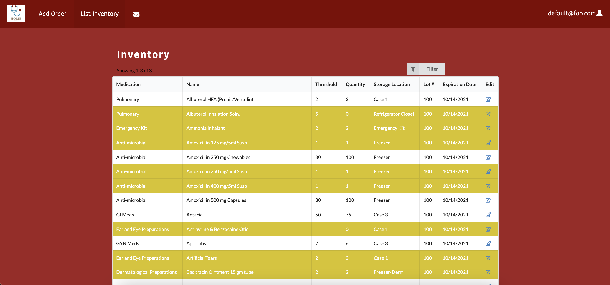
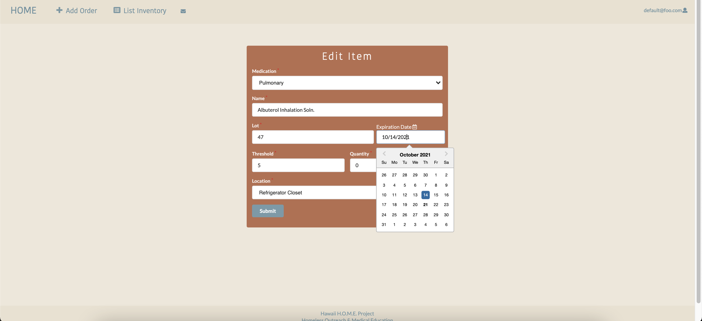

## Hawaii HOME Poject

### Goal

The goal of Hawaii HOME Project is to create a mobile application to aid a medical clinic to keep track of current inventory of medications and supplies, vaccines records, and have acess to patient's health information. 

As we progress through the development of this web application, our vision for the layout of our application will reflect the following pages:

- Sign in/Sign up Page
- Landing Page
- Add Order
- Inventory Page
- Low-Inventory Report Page
- Edit Inventory

### Sign in/Sign up Page

### Landing Page

### Add Order

### Inventory Page

### Low-Inventory Notification

### Low-Inventory Report

### Edit Inventory

