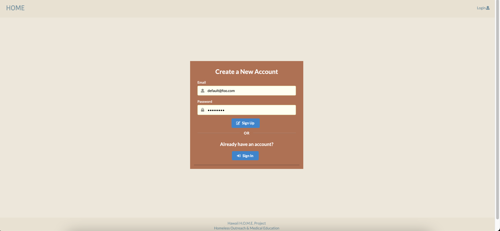

## Hawaii HOME Poject

### Goal

The goal of Hawaii HOME Project is to create a mobile application to aid a medical clinic to keep track of current inventory of medications and supplies, vaccines records, and have acess to patient's health information. 

As we progress through the development of this web application, our vision for the layout of our application will reflect the following pages:

- Landing Page
- Sign in/Sign up Page
- Inventory Page
- Edit Inventory
- Add Order

### Landing Page

### Sign in/Sign up Page

### Inventory Page

### Edit Inventory

### Add Order

