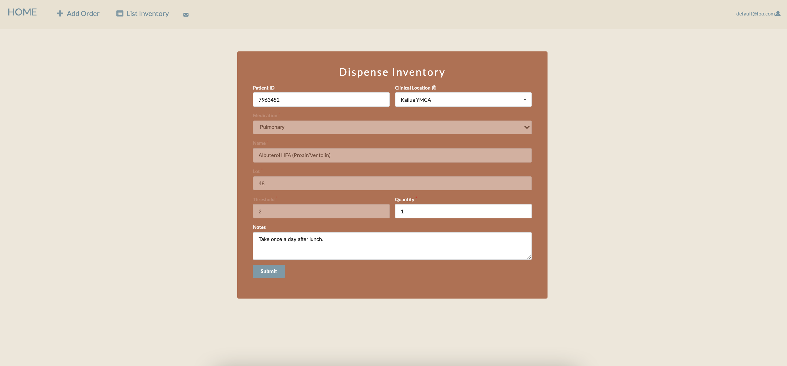
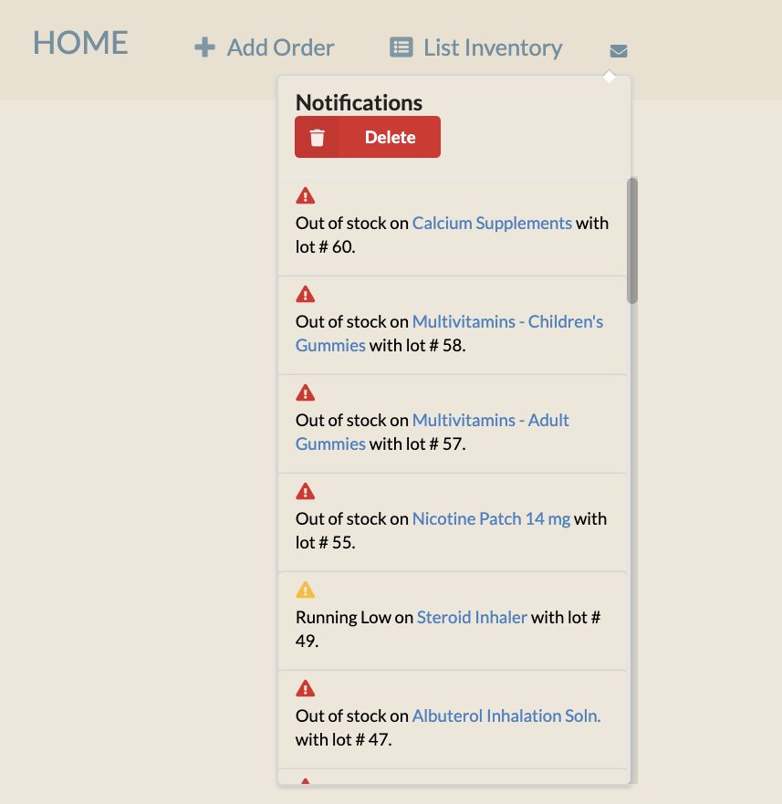

## Hawaii HOME Poject

### Goal

The goal of Hawaii HOME Project is to create a mobile application to aid a medical clinic to keep track of current inventory of medications and supplies, vaccines records, and have acess to patient's health information. 

### Deployment

https://runtime-terror.xyz/#/

As we progress through the development of this web application, our vision for the layout of our application will reflect the following pages:

- Sign in/Sign up Page
- Landing Page
- Add Order
- Inventory Page
- Edit Inventory
- Dispense

Admin and Super Role:
- Manage Accounts
- Log History

Features encapsulated in the pages: 
- Notifications
- Search Bar, Filter, Dispense by Lot (List Inventory Page)
- Change Role, Remove Account (Manage Account Page)

### Sign in/Sign up Page

### Landing Page

### Add Order

### Inventory Page

### Edit Inventory

### Dispense Inventory

### Notification

### Filter

### Seach By Name

### Dispense By Lot Number

## Admin and Super Level

### Manage Accounts

### Log History

